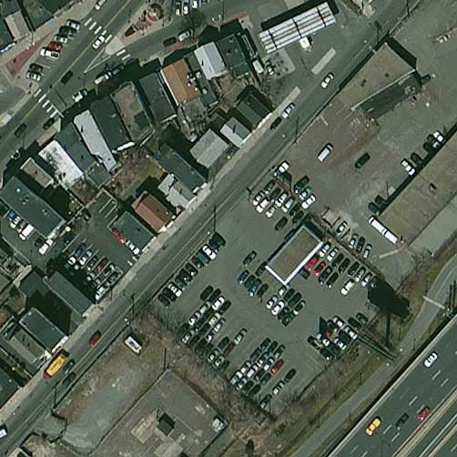
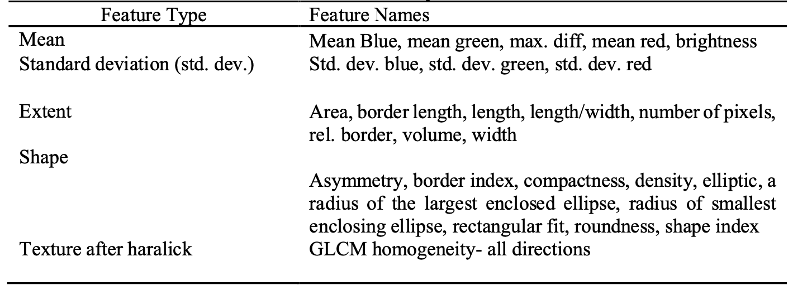
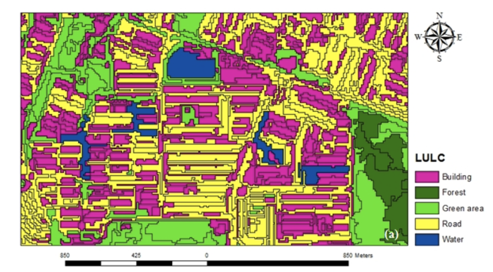
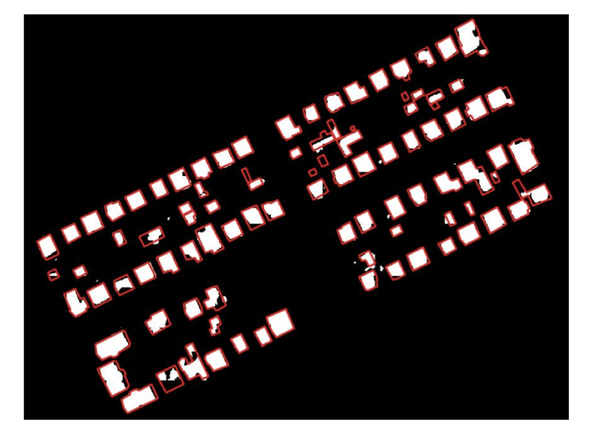

```{r setup, include=FALSE}
options(htmltools.dir.version = FALSE)
```

class: center, middle

# osyz

### test
---
## Data
.pull-left[
**WorldView-3**
- Very High Resolution(VHR)
  - Multispectral(R,G,B,NIR) 1.24m
- Revisits less than one day
- Standard image products available
  - radiometrically corrected, sensor corrected, orthorectified and projected to the Earth’s Surface.
  
**TAKBIS**
- Land Registry and Cadastre Information System in Turkey
- Provide ownership and cadastral information in land registry
]

.pull-right[
```{r echo=FALSE, fig.align='bottom'}

```

.small[WorldView3 imagery. Source:[DigitalGlobe](https://worldview3.digitalglobe.com/)
]
]

---
## Object-based Image Analysis
```{r xaringan-panelset, echo=FALSE}
xaringanExtra::use_panelset()
```
.panelset[
.panel[.panel-name[Image Segmentation]
**Multi-resolution segmentation(MRS)**
  - Extract reasonable objects that can be used in next steps
  
  - Three parameters to partition an image into objects: scale, shape, and compactness. 
  
**Spectral difference segmentation**
  - Merge neighboring image objects
  
    - if the difference between their layer mean intensities lower than the value given by the maximum spectral difference
  ]
.panel[.panel-name[Feature Selection]
27 features selected within eCognition for each object

```{r echo=FALSE}

```
]
.panel[.panel-name[Classification]
Support Vector Machine with optimum feature selection to classify the objects as buildings or non-buildings(forest, green area, road and water). 

```{r echo=FALSE,, out.width='80%', fig.align='center'}

```
.small[Classification using SVM.Source: Norman et al., 2021]
]
]
---
## Identifying Illegal Buildings
.pull-left[

Compare the buildings in the classification map with cadastral digital map
  - The buildings that are contradict to cadastral would be identified illegal.


###Validation!

Visit the sites of the identified buildings and verify their legality using on-site inspections or by consulting with local authorities
]

.pull-right[

```{r echo=FALSE, out.width='120%'}

```
.small[ Ground truth cadastral data overlap with results.Source: Jovanović et al., 2021]
]
