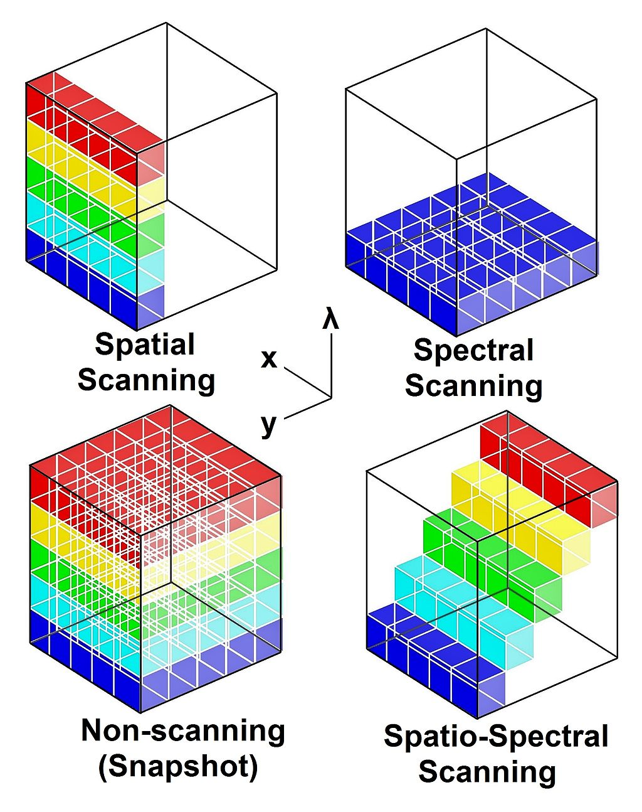
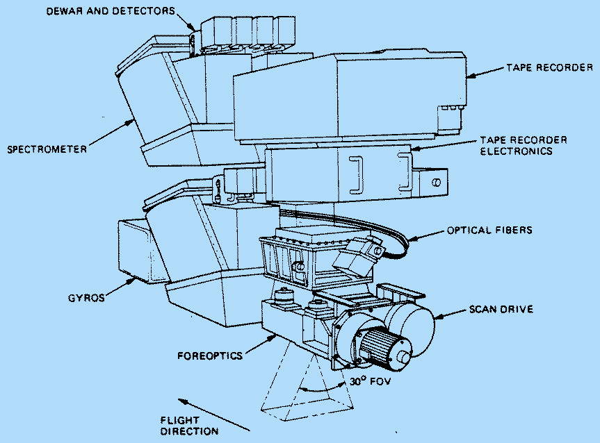
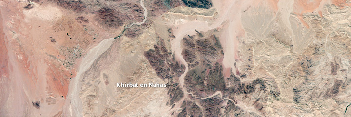
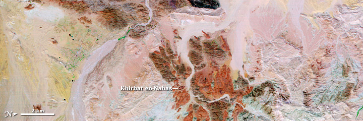

class: inverse, left-left, title-slide, middle

```{r include=FALSE, warning=FALSE}
library(countdown)
library(xaringan)
library(xaringanExtra)
library(knitr)
library(RefManageR)
library(knitcitations)
library(xaringanthemer)

style_mono_accent(base_color = "#1381B0")
```

```{r xaringanExtra-search, echo=FALSE}
xaringanExtra::use_search(show_icon = TRUE)
```

```{r load_packages, message=FALSE, warning=FALSE, include=FALSE}
library(fontawesome)
```

```{r xaringan-panelset, echo=FALSE}
xaringanExtra::use_panelset()
```

```{r setup, include=FALSE}
options(htmltools.dir.version = FALSE)
BibOptions(check.entries = FALSE, bib.style = "authoryear",cite.style = "authoryear", style = "markdown", hyperlink = TRUE, dashed = TRUE, no.print.fields=c("doi", "url", "urldate", "issn"))
myBib <- RefManageR::ReadBib("Bib.bib")
```

background-image: url("img/piqiang_ast_2005055_468_decorrelation_lrg.jpg")
background-size: cover
background-position: center

## Introduction to Hyperspectral Radiometer

***

### CASA0023 WEEK2

### *Xianlai Yin*

---

### Summary

#### Hyperspectral Radiometer

.pull-left.w60[
.panelset[
.panel[.panel-name[Definition]
Hyperspectral Radiometer is ***"An advanced multispectral sensor that detects hundreds of very narrow spectral bands throughout the visible, near-infrared, and mid-infrared portions of the electromagnetic spectrum. This sensor’s very high spectral resolution facilitates fine discrimination between different targets based on their spectral response in each of the narrow bands."*** `r Citep(myBib,"earth_science_data_systems_active_2021")`

Hyperspectral cubes are generated from airborne sensors like NASA's [Airborne Visible/Infrared Imaging Spectrometer (AVIRIS)](https://www.jpl.nasa.gov/missions/airborne-visible-infrared-imaging-spectrometer-aviris), or from satellites like NASA's [EO-1](https://earthobservatory.nasa.gov/features/EO1) with its hyperspectral instrument Hyperion.
]

.panel[.panel-name[Sensors]
Figuratively speaking, hyperspectral sensors collect information as a set of 'images'. Each image represents a narrow wavelength range of the electromagnetic spectrum, also known as a spectral band. These 'images' are combined to form a three-dimensional (x,y,λ) hyperspectral data cube for processing and analysis, where x and y represent two spatial dimensions of the scene, and λ represents the spectral dimension (comprising a range of wavelengths).`r Citep(myBib,"noauthor_spectral_nodate")`

Technically speaking, there are four ways for sensors to sample the hyperspectral cube: ***Spatial scanning***, ***spectral scanning***, ***snapshot imaging***, and ***spatio-spectral scanning***.
]
]
]

.w35.pull-right[
```{r echo=FALSE,, out.width='70%', fig.align='center'}

```
.center[
<font size = 3>Hyperspectral datacube. Source: [Wikipedia](https://en.wikipedia.org/wiki/Hyperspectral_imaging#/media/File:AcquisitionTechniques.jpg)
]
]

---

### Summary

#### AVIRIS

.pull-left.w60[
AVIRIS is a proven instrument in the realm of Earth Remote Sensing. It is a unique optical sensor that delivers calibrated images of the upwelling spectral radiance in 224 contiguous spectral channels (bands) with wavelengths from 400 to 2500 nanometers. 

AVIRIS has been flown on four aircraft platforms: NASA's ER-2 jet, Twin Otter International's turboprop, Scaled Composites' Proteus, and NASA's WB-57.

The main objective of the AVIRIS project is to ***identify, measure, and monitor constituents of the Earth's surface and atmosphere based on molecular absorption and particle scattering signatures***. Research with AVIRIS data is predominantly focused on understanding processes related to the global environment and climate change.`r Citep(myBib,"noauthor_aviris_nodate")`
]

.w35.pull-right[
```{r echo=FALSE,, out.width='100%', fig.align='center'}

```
<font size = 3>AVIRIS Instrument: Silicon (Si) detectors for the visible range, indium gallium arsenide (InGaAr) for the NIR, and indium-antimonide (InSb) detectors for the SWIR. Source: [JPL, NASA](https://aviris.jpl.nasa.gov/aviris/instrument.html)
]

---

### Application

#### Application scenarios related to remote sensing

Hyperspectral remote sensing is used in a wide array of applications. Although originally developed for mining and geology *(the ability of hyperspectral imaging to identify various minerals makes it ideal for the mining and oil industries, where it can be used to look for ore and oil)*, it has now spread into fields as widespread as ecology and surveillance, as well as historical manuscript researc.`r Citep(myBib,"noauthor_hyperspectral_2023")`
***

***Environmental monitoring***: the hyperspectral radiometer can be used to monitor environmental parameters such as air, water and soil, such as gas concentration, chlorophyll concentration in water, soil moisture, etc., thus providing data to support environmental monitoring and protection.

***Agriculture***: the hyperspectral radiometer can be used to monitor plants and provide information on their growth status, pests and diseases to guide agricultural production and plant protection.

***Geological research***: the hyperspectral radiometer can be used to study the mineral composition, rock types and topographic features of the earth's surface, providing data to support geological research.

---

### Application

#### Application case

***Better target excavation at likely smelting sites and mines***: Just as iron and copper look different in visible light, iron- and copper-rich minerals reflect varying amounts of light in the infrared spectrum, the hundreds of bands in hyperspectral imagery enable researchers to differentiate minerals and rocks that appear similar in visible light. Outcrops near Khirbat en-Nahas that are uniformly dark in natural color are variegated in false-color, signifying different rock types.`r Citep(myBib,"noauthor_earth_2010")`

.pull-left[
```{r echo=FALSE,, out.width='100%', fig.align='center'}

```
<font size = 3>natural color. Source: [earthobservatory, NASA](https://earthobservatory.nasa.gov/features/EO1Tenth/page3.php)
]

.pull-right[
```{r echo=FALSE,, out.width='100%', fig.align='center'}

```
<font size = 3>false-color. Source: [earthobservatory, NASA](https://earthobservatory.nasa.gov/features/EO1Tenth/page3.php)
]

---

### Reflection: Advantages & Disdvantages

.pull-left[
#### Advantages

- Because an entire spectrum is acquired at each point, the operator needs no prior knowledge of the sample, and ***postprocessing allows all available information from the dataset to be mined***.

- Hyperspectral imaging can also take advantage of the spatial relationships among the different spectra in a neighbourhood, allowing more elaborate spectral-spatial models for a ***more accurate segmentation and classification of the image***.
]

.pull-left[
#### Disdvantages

- Significant data storage capacity is necessary since uncompressed hyperspectral cubes are large, multidimensional datasets, potentially exceeding hundreds of megabytes. All of these factors ***greatly increase the cost of acquiring and processing hyperspectral data***. 

- One of the hurdles researchers have had to face is finding ways to program hyperspectral satellites to sort through data on their own and transmit only the most important images, as ***both transmission and storage of that much data could prove difficult and costly***.
]

---

### Reflection: Why it is useful for me

For the field of urban planning, the hyperspectral data of the urban environment collected by the Hyperspectral Radiometer can support a large number of analyses:

- ***Vegetation cover analysis***: Hyperspectral Radiometer can measure vegetation spectral data in different wavelength ranges to analyse the vegetation cover in different areas of the city. This can help to better understand the ecology of the city and take steps to increase the green space in the city.

- ***Air quality analysis***: The Hyperspectral Radiometer measures radiation in the atmosphere at different wavelength ranges, which is useful for analysing airborne pollutants, particulate matter and greenhouse gases, for example. This data can help to better understand the air quality situation in a city and take steps to improve it.

- ***Thermal environment analysis***: The Hyperspectral Radiometer can measure surface temperatures in different wavelength ranges, which can help to better understand the thermal environment of a city and take measures to improve it.

These analyses can provide a great support for the monitoring and research of the urban environment to improve the livability of cities.

---

class: left, left

### References

<font size = 3>
```{r, results='asis', echo=FALSE}
RefManageR::PrintBibliography(myBib,start = 1, end = 5)
```

---


class: inverse, center, middle

## THANK YOU

*Xianlai Yin*